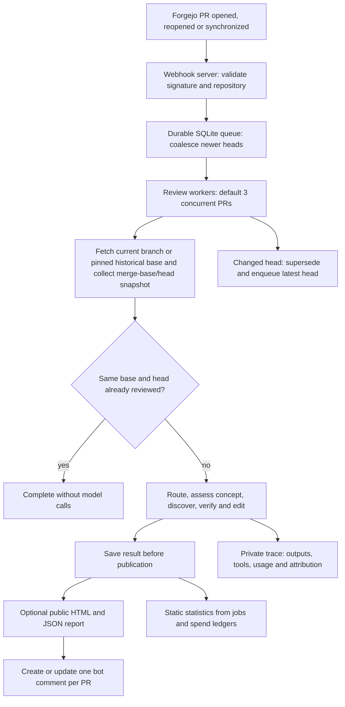
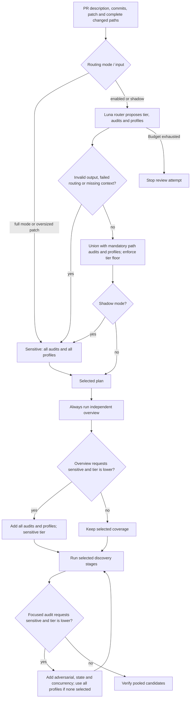
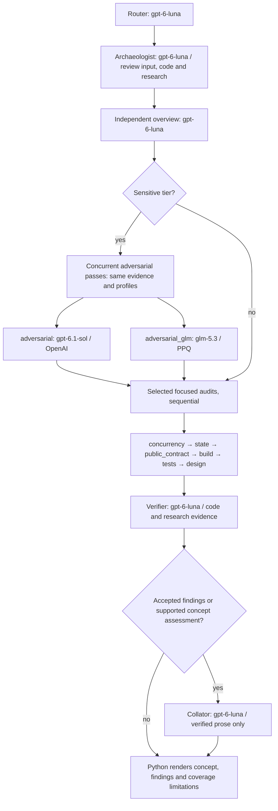
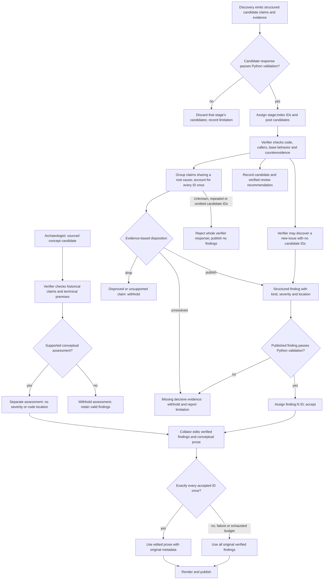

# ralph structure

The bot performs static Bitcoin Core PR reviews. It discovers candidate findings
in independent passes, checks them against repository evidence, and publishes
verified findings and a separately verified conceptual assessment. It does not
build or execute PR code.

These diagrams describe the checked-in defaults. [models.json](audits/models.json)
assigns models; callers can replace the complete map with `--models-json`.
The [NixOS module documentation](../../modules/ralph/README.md)
covers deployment and options. Mermaid diagrams render in supporting Markdown
viewers; their source remains readable in a plain text editor.

## Service and review lifecycle

Only one attempt runs per PR. Fetch and snapshot preparation share a Git lock;
model calls run outside it. Each attempt pins its Git objects with separate refs.
Head checks prevent stale reviews from being published. Publication retries reuse
saved results rather than paying for another review. Transient transport failures
have bounded job retries. Oversized inputs use a changed-file manifest and diff
tools; if the PR prelude and manifest still exceed 200,000 bytes, review is skipped.

Sources: [service.py](ralph/service.py),
[jobs.py](ralph/jobs.py), [repository.py](ralph/repository.py).

The HTTP listener also serves per-PR PNG status dots at
`/assets/<owner>/<repo>/<pr>.png`. They are Bitcoin orange (`#f7931a`) when the
latest queued generation has published findings or a conceptual concern,
including feedback from partial reviews. All other results are grey. Neither
colour indicates approval or a pass/fail verdict. Status comes from the existing
job store without model or Forgejo API calls. See the module documentation for
proxy setup.

## Audit selection

The router can add coverage but cannot remove path-mandated coverage. A sensitive
tier always adds adversarial review, even when no domain profile is selected.
Profiles extend the adversarial prompt; they are not separate model calls.

| Changed paths, excluding tests where stated | Mandatory coverage / tier floor |
| --- | --- |
| Documentation or tests only | Routine floor; tests audit for test changes |
| Production code, excluding docs, tests and recognized build paths | Standard floor; tests and design audits |
| Consensus, validation, script, chainstate, serialization and related paths | Sensitive; consensus profile |
| Wallet paths | Sensitive; wallet profile |
| Network, policy, mempool and related paths | Sensitive; p2p profile |
| Synchronization, scheduler, queues, validation callbacks, thread utilities | Sensitive; concurrency audit |
| Databases, indexes, wallet storage, chainstate and block storage | Sensitive; state audit |
| RPC, CLI, HTTP, REST, initialization and argument handling | Sensitive; public_contract audit |
| Recognized build paths, including CMake, depends, Guix, CI and Cargo/flake locks | Sensitive; build audit |
| Crypto and secp256k1 paths | Sensitive floor |

These are summaries of the regex rules in [routing.py](ralph/routing.py).
Rules overlap. The router can select any additional audit or profile based on
behavior, including effects that filenames alone do not reveal. Empty audit and
profile lists are valid when no coverage applies. Routine does not mean no review.

## Stages, models and evidence

Skipped audits do not make model calls. Escalation can add pending stages during
discovery. Sol and GLM run concurrently when a PPQ key is supplied; without that
key, the Python pipeline runs Sol alone. The service CLI requires both keys.
The archaeologist runs after routing and before code discovery. Its assessment
is advisory only: negative, failed or incomplete concept research never skips an
independent, adversarial or focused code stage selected for the review.
Reviewers do not see other discovery passes' candidates. The verifier sees the
pooled candidates, original review input and archaeology candidate. Code
discovery does not receive the archaeology output or current PR discussion.

| Stage | Default model | Reasoning effort | Per-response output token ceiling | Evidence access |
| --- | --- | --- | --- | --- |
| router | gpt-6-luna | low | 4,000 | Supplied input only |
| independent | gpt-6-luna | low | 4,000 | Full tool set |
| adversarial | gpt-6.1-sol | high | 25,000 | Full tool set and selected domain profiles |
| adversarial_glm | glm-5.3 | high | 25,000 | Same tools and profiles, via PPQ |
| concurrency | gpt-6-luna | medium | 8,000 | Focused input and code tools |
| state, public_contract, build, tests | gpt-6-luna | low | 4,000 | Focused input and code tools |
| design | gpt-6-luna | xhigh | 25,000 | Focused input, code tools and merge-base developer notes |
| verifier, routine/standard | gpt-6-luna | low | 8,000 | Original input, candidates, concept candidate, code and research tools |
| verifier, sensitive | gpt-6-luna | high | 25,000 | Original input, candidates, concept candidate, code and research tools |
| archaeologist | gpt-6-luna | low | 4,000 | Original input, base/head code tools, current discussion and research tools |
| collator | gpt-6-luna | low | 6,000 | Accepted findings and conceptual assessment; no tools |

Code tools find paths, read head/base files, read diffs and search code. The full
tool set also reads base history and other PR discussions. Current PR discussion
is excluded from code discovery. The archaeologist and verifier can read current
discussion and original upstream review threads. Frozen evaluations replay only
captured research evidence and disable live discussion or web fallback. If a
research call is missing from the frozen manifest, the tool returns an
unavailable-evidence message and the model continues from code and frozen input.

Discovery allows 12 tool calls at routine tier, 24 at standard, and 48 at sensitive.
Both adversarial passes and verification allow 48. History and discussion
sublimits are eight each per tool-enabled stage. Archaeology has twelve total
inspections. Hosted web actions count toward the stage limit and are capped at
two per response. Search fees and evidence-token headroom are reserved in the
existing OpenAI allowance; opening or finding text within a page is not a paid
search action. The early concept stage spends from the same capped review
allowance, does not estimate savings and never stops later code stages.
Independent, adversarial and verifier stages require a first inspection. At
limits, a final turn uses collected evidence and must preserve uncertainty.

OpenAI's default estimated review allowance is USD 1.00; PPQ has a separate
USD 0.50 allowance. Routing and discovery protect OpenAI verifier headroom,
refreshed as candidates accumulate. Admission checks also protect a final model
response after inspection. Budget limits can still prevent completion, including
through competing workers' monthly spending. Failed discovery becomes a coverage
limitation; failed verification publishes no unverified findings. Failed editing
falls back to verified wording.

Sources: [pipeline.py](ralph/pipeline.py),
[model.py](ralph/model.py), [spend.py](ralph/spend.py),
[config.py](ralph/config.py).

## How findings survive or get rejected

Candidate findings are leads, not votes. Agreement between Sol, GLM and focused
reviewers gives a claim no extra weight. A defect needs a reachable trigger and
consequence, checked against the strongest code-based reason it might be false.
Static proof can suffice; running a reproduction is not required. Defect
discovery remains independent of the concept assessment, PR discussion and
upstream review threads.

Design findings need an established premise and material tradeoff. A grounded
question can survive even when the implementation is correct and the author must
supply a requirement or measurement. Uncertainty about the choice differs from
missing evidence for its premise. Suggestions need a concrete present cost and
supported alternative. Generic questions, unsupported alternatives, preferences
presented as bugs, insults and inferred motives should be rejected by the verifier.
These are prompt requirements, not mechanical proof checks.

Python enforces structure, candidate accounting, allowed kinds and severities,
nonempty required text, and locations in changed paths that exist on the specified
head/base side with positive integer lines. The verifier must check the actual
line and claim; Python does not check line bounds or prove factual correctness.
Malformed discovery rejects the entire stage result. A malformed published
finding becomes unresolved while other valid findings survive. Structural or
candidate-accounting errors reject the entire verifier response.

Partial coverage does not discard otherwise valid findings. An unresolved
candidate or failed stage adds a limitation. The collator cannot add, merge or
remove accepted IDs, or change their kind, severity or location. Python enforces
those metadata constraints; preservation of meaning is a prompt requirement.

Rendering groups findings first, with critical, major, minor, then suggestions.
Design and approach feedback follows, then at most one independently verified
optional alternative. Design kind determines its own section. A useful
alternative can be published even when the PR's overall approach is sound.
The comment contains the commit header, verified review and optional report link.
Reports expose stage replies, dispositions and attribution. Statistics distinguish
sole and shared accepted findings; verifier acceptance is not human validation
or a measurement of recall. Profiles within one adversarial call get no separate
causal credit.

Sources: [protocol.py](ralph/protocol.py),
[verifier prompt](audits/verifier.md), [collator prompt](audits/collator.md),
[report.py](ralph/report.py), [stats.py](ralph/stats.py).

## Concept and history

The archaeologist receives the full review input plus base/head code tools. It
runs after routing and before independent discovery. It researches whether the
proposed goal and approach are worth pursuing, while code review continues no
matter what it recommends. It establishes the problem, the cost of doing
nothing, the benefit delivered by the submitted proposal, and relevant prior
attempts. It compares the proposal with the baseline and up to two credible
alternatives, identifying where each alternative came from. Promised follow-ups
do not count as delivered benefits.

Research follows explicit references before searching more broadly. Discussion
reads use bounded pages and can fetch a linked GitHub comment directly. Returned
text records retrieval time and truncation; private traces retain the evidence
sent to models. Hosted search actions and source links appear in report metadata. Historical
claims need source links. Earlier objections must be checked for later answers;
an abandoned PR does not establish that its concept was rejected. Skepticism
applies to the status quo and suggested alternatives as well as the proposal.
The brief records technical assumptions for the verifier, a conditional
recommendation, and the question or evidence most likely to change it. Its
structured proposal includes `goal`, an `assessment` of `worth_pursuing`,
`needs_motivation`, `rework_approach` or `not_worth_pursuing`, and an advisory
`proposed_review` of `continue`, `would_stop` or `undetermined` with a
`review_reason`. It does not produce code findings, assign severity or emit
ACK/NACK labels.

After a valid concept candidate, blind alternatives are enabled by default. This
uses the existing archaeologist model with base-only code tools and neutral
problem, goal and baseline inputs. Its result goes to the verifier, not to
discovery. The pipeline still runs every selected code stage.

The verifier checks the premises before accepting public conceptual feedback.
It records both the archaeologist's proposed review recommendation and its own
final recommendation. Conceptual feedback must identify a supported, actionable
objection to the PR's premise or approach. Separately, it may publish one
evidence-backed optional alternative that improves a meaningful dimension such
as simplicity, maintenance, or caller ergonomics, with its tradeoffs stated.
Favorable assessments and rejected or inconclusive alternatives stay in the
detailed trace.

Conceptual feedback has no finding ID, severity or artificial source location.
The collator can edit it even when there are no accepted code findings. It edits
finding wording and any concept objection; the optional alternative is rendered
from verifier-approved structured fields. The public comment groups findings
first, then design and concept feedback, then the optional alternative. It omits
objections already covered by accepted design findings. A question belongs in
concept feedback only if its answer settles a specific material concern.
Invalid or unverified assessments are withheld. Failed editing falls back to
verified wording.

Reports and statistics count published concept assessments separately from
findings and distinguish them from completed research. They also expose
candidate and verifier review recommendations so a human can score false
proposed stops and useful code findings that appeared after a `would_stop`
recommendation. Archaeology usage and costs remain visible, but the stage does
not compete in the finding leaderboard. These counts measure output, not
recommendation quality.
For a before/after comparison, use the same PR head and inspect whether the new
assessment recovers material history, recognises answered objections, and makes
a defensible choice between approaches. A live rerun can see newer discussion;
its evidence is not a frozen historical replay.
